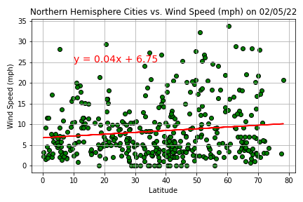

Check out the website for this project!

[Project Page Website](https://charlesphil.github.io/python-api-challenge)

---

# Python-api-challenge

Contained in this README are three observations from the WeatherPy Notebook and the two
maps from the VacationPy Notebook.

## Three observations from WeatherPy (Part 1)

NOTE: For specific correlation values and trend interpretations, please refer to
the relevant cell for each plot in the WeatherPy notebook.

### Observation 1: latitude and temperature are definitely related.

Looking at the temperatures plotted against each city's latitude, we see a large
rise and fall that peaks around the equator. There is such a sharply outlined
shape that it is hard to pretend that there could be no relationship between
latitude and temperature.

We can confirm that there is a strong correlation when we break down the plot
between the northern and southern hemispheres:

While there are a variety of other factors to consider when it comes to
temperature, it is very apparent that the northern cities with similar latitudes
have similar temperatures. It could be that those cities share similar features
with regards to climate, geography, and so on. Especially with it being winter
in the northern hemisphere, we would indeed expect temperatures to fall as we
go north.

With southern cities, we see a less strong correlation, which is interesting to
see given the strength of the correlation among northern cities and their
temperatures. My initial guess as to why this might be the case is that cities
located on the southern hemisphere share fewer geographic and climate features
between one another compared to cities in the northern hemisphere. It would be
useful to get geographic data to confirm this hypothesis.

### Observation 2: latitude and cloudiness result in two clusters.

Just from looking at the total scatter plot for cloudiness against latitude, we
see two clusters form where cloudiness is either 0 or 100% regardless of
latitude, with a number of points spaced out between the two areas. As a result,
the resulting split between the northern and southern hemisphere cities are
very similar:

Both resulted in a weak positive correlation, but it seems that the reason the
regression line results in a positive correlation is because it is attempting to
fit the data on both extremes. I also think that because cloudiness changes
at random due to atmospheric variables, it would be better to look at cloudiness
data over a period of days, as opposed to just finding the cloudiness of a city
on any one specific day to get a better sense of where a trend, *if any*,
exists.

### Observation 3: latitude and wind speed have nothing to do with each other.

Immediately from the scatter plot, we see a **dense** linear cluster all along
the x-axis between 0 and 10 mph. Even after separating between northern and
southern cities, we see similar result:

What is different between the two halves, however, is that currently the range
of wind speeds in northern cities is much wider, ranging from 0 to 35 mph as
opposed to 0 to 25 in the south. Much like cloudiness, however, wind speed is
extremely dependent on atmospheric variables, as opposed to global positions.
Just like cloudiness, it would be better to look at wind speed over a period of
time to account for the day-to-day differences in wind speed. My initial
assumption, however, is that we are unlikely to see any relationship come about
from doing so.

## Maps from VacationPy

### Heat map

NOTE: I used a maximum intensity of 200 because an oddly large amount of cities
had humidities reaching 100% on the day I queried the weather data. Setting the
maximum intensity to 100 resulted in an overwhelmingly red map, obscuring
any potential gradients for cities located near the 100% humid ones.

### ~~Hotel~~ Lodgings map

For this map, I had several results where **there was lodging available in the**
**city but no hotels.** The reason for this is because I had cities with
extremely small population sizes (New Norfolk, Australia has a population size
of 6,000 people, for example), meaning that there is no reason for
any *hotel* to be in the area. Because of this, I adjusted the query and code to
display *lodging* data, instead of *hotels*.
